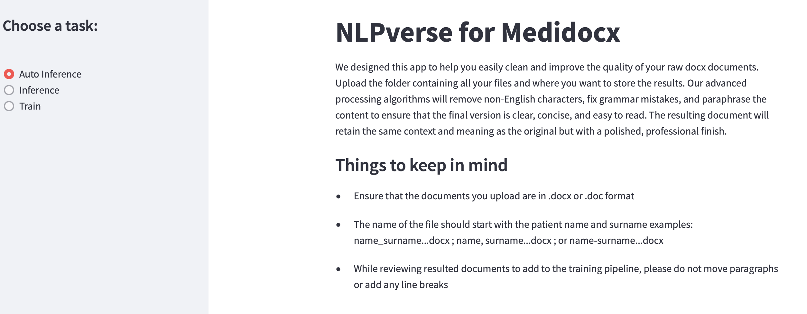
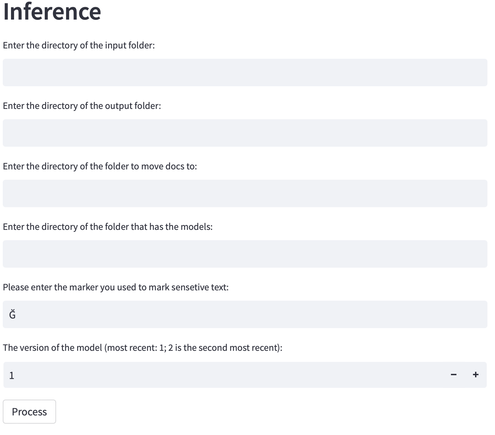
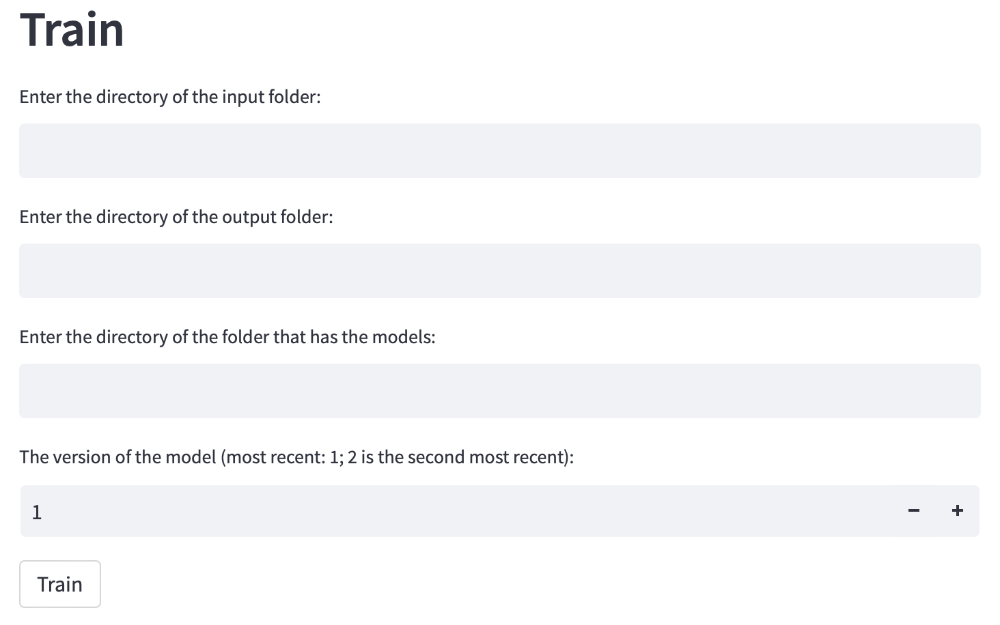

# NLP tool for Microsoft Word Documents Processing 

We designed this app to help you easily clean and improve the quality of your raw docx documents. Upload the folder containing all your files and where you want to store the results. Our advanced processing algorithms will remove non-English characters, fix grammar mistakes, and paraphrase the content to ensure that the final version is clear, concise, and easy to read. The resulting document will retain the same context and meaning as the original but with a polished, professional finish.

The app is a `python` app and runs on `Streamlit` for front-end, it comes with a `sh` and `bat` files so it will run in one click for Windows, Mac and Linux. 

## Things to keep in mind
- Ensure that the documents you upload are in .docx or .doc format
- The name of the file should start with the patient name and surname examples: name_surname...docx ; name, surname...docx ; or name-surname...docx
- While reviewing resulted documents to add to the training pipeline, please do not move paragraphs or add any line breaks

## Usage

To launch the app, follow the steps below:

- Mac or Linux: Click on `APP.sh`
- Windows: Click on `APP.bat`

The app will launch with a user interface in your browser. The results and progress of the app will be printed in the command terminal.

Note: The app requires python do be installed and in the directory (any python version under 3.10). Make sure python is installed and visible, all other dependencies will be installed while launching the app.

## Tasks
- `Inference`: Cleans and paraphrases the docs presented in the directory. It also highlights the patient names and highlights any new words not found in the original document
- `Auto Inference`: Runs inference very time there is a new file added to the folder  
- `Train`: Trains the model to learn your tone of writing

## More On Inference Script

  

This script implements several functionalities such as paraphrasing, spelling correction, and text cleaning, specifically removing non-English characters. The script uses several libraries such as `sys`, `os`, `docx`, `re`, `transformers`, `nltk`, `textblob`, and `shutil`.

The script takes several command line arguments including the input directory, output directory, training directory, model directory, number of models, and a marker input.

The `paraphrase_med` function takes in a text and a maximum length, and returns a paraphrased text using the T5 model. 

The `remove_non_english_characters` function takes in a raw input and an identifier and returns the input after removing all non-English characters, except those in the identifier.

The `correct_sentence_spelling` function takes in a sentence and returns the corrected spelling using TextBlob library.

The `clean_para_text` function takes in a text, a marker, a `paraphrase_med` function and a maximum length, and returns the cleaned text, by removing non-English characters and correcting spelling errors.

The script uses the `glob` library to find all `.docx` files in the input directory and processes them one by one, saving the cleaned text to the output directory.

The script also moves the processed `.docx` files to the training directory, so that the models can be retrained with the new data.

## More On Auto Inference Script

  

The auto inference feature of this code allows you to continuously monitor a directory for new .docx or .doc files and automatically process them with a pre-trained NLP model. Here's a brief overview of how it works:

1. You specify the directory to be monitored for new files.
2. When a new file is detected in the directory, the code runs the inference process with the selected NLP model.
3. The resulting file is saved in the specified output directory.
4. The app detects everytime a new file is added and waits for few minutes, number of minutes is specified by user

## More On Training Script

  

The training script is used to train the T5 model for text generation. The script accepts the following parameters as inputs:
1. `dir_in`: The directory that contains the input files.
2. `dir_out`: The directory that contains the target files.
3. `dir_model`: The directory where the trained models will be saved.
4. `num_v`: The version of the model that you want to train.

The script performs the following steps:
1. Loads the input and target files from the specified directories.
2. Processes the input files to extract relevant information.
3. Splits the input and target data into training and validation sets.
4. Trains the T5 model using the training data.
5. Saves the trained model to the specified directory.
